# 🏥 INNO Platform - System Architecture

## Overview
healthSaarthi is a comprehensive healthcare platform that combines **real-time ambulance services**, **MiBand fitness tracking**, **mental health assessment**, and **AI-powered medical services** for emergency and wellness management.

## 🏗️ System Architecture Diagram

```mermaid
graph TB
    %% User Layer
    subgraph "👤 User Interface Layer"
        UI[React TypeScript SPA]
        Mobile[Mobile Responsive UI]
        PWA[Progressive Web App]
    end

    %% Frontend Services
    subgraph "🎨 Frontend Services"
        Dashboard[Dashboard Service]
        Auth[Authentication Service]
        Router[React Router Navigation]
        State[State Management]
    end

    %% Core Application Services
    subgraph "🏥 Healthcare Services"
        direction TB
        
        subgraph "🚑 Emergency Services"
            Ambulance[Ambulance Tracking]
            GPS[GPS Location Service]
            Maps[Interactive Maps]
            Routing[Road-based Routing]
            Emergency[Emergency Contacts]
        end
        
        subgraph "🧠 Mental Health Services"
            Assessment[Mental Health Assessment]
            GAD7[GAD-7 Anxiety Scale]
            PHQ9[PHQ-9 Depression Scale]
            Lifestyle[Lifestyle Evaluation]
            MindSpace[MindSpace Dashboard]
        end
        
        subgraph "⌚ Fitness & Wearables"
            MiBand[MiBand Integration]
            Bluetooth[Bluetooth Connectivity]
            Activity[Activity Tracking]
            Battery[Battery Monitoring]
            Sync[Device Synchronization]
        end
        
        subgraph "🤖 AI Medical Services"
            Chatbot[Medical Chatbot]
            Vision[Computer Vision]
            Disease[Disease Detection]
            Exercise[Exercise Guidance]
            Analytics[Health Analytics]
        end
        
        subgraph "📋 Healthcare Management"
            Doctors[Doctor Categories]
            Vaccination[Vaccination Tracker]
            Appointments[Appointment System]
            Records[Medical Records]
        end
    end

    %% Data Layer
    subgraph "💾 Data Layer"
        LocalDB[IndexedDB - Local Storage]
        SessionData[Session Storage]
        Cache[Browser Cache]
        LocalState[Local State Management]
    end

    %% External Services
    subgraph "🌐 External APIs & Services"
        Maps_API[OpenStreetMap API]
        OSRM[OSRM Routing Service]
        Geolocation[Browser Geolocation API]
        WebBluetooth[Web Bluetooth API]
        Weather[Weather API]
        Netlify[Netlify Functions]
    end

    %% Hardware Integration
    subgraph "📱 Hardware Integration"
        Camera[Device Camera]
        MiBandHW[MiBand Hardware]
        GPS_HW[GPS Hardware]
        Sensors[Device Sensors]
    end

    %% Connections
    UI --> Dashboard
    UI --> Auth
    UI --> Router
    
    Dashboard --> Ambulance
    Dashboard --> Assessment
    Dashboard --> MiBand
    Dashboard --> Chatbot
    Dashboard --> Vision
    
    Ambulance --> GPS
    Ambulance --> Maps
    Ambulance --> Routing
    
    Assessment --> GAD7
    Assessment --> PHQ9
    Assessment --> Lifestyle
    Assessment --> MindSpace
    
    MiBand --> Bluetooth
    MiBand --> Activity
    MiBand --> Battery
    
    GPS --> Geolocation
    Maps --> Maps_API
    Routing --> OSRM
    Bluetooth --> WebBluetooth
    
    Dashboard --> LocalDB
    Assessment --> LocalDB
    MiBand --> LocalDB
    
    MiBand --> MiBandHW
    Vision --> Camera
    GPS --> GPS_HW
    
    Netlify --> Weather
    
    style UI fill:#e1f5fe
    style Dashboard fill:#f3e5f5
    style Assessment fill:#e8f5e8
    style MiBand fill:#fff3e0
    style Ambulance fill:#ffebee
    style LocalDB fill:#f1f8e9
```



## 🔧 Technical Architecture

### Frontend Architecture


### Service Architecture


## 📊 Data Flow Architecture

### Mental Health Assessment Flow


### MiBand Integration Flow


### Emergency Services Flow


## 🗄️ Data Models

### Mental Health Assessment Data
```typescript
interface AssessmentResult {
  id: string;
  timestamp: Date;
  gad7Score: number;
  phq9Score: number;
  lifestyleScore: number;
  confidenceScore: number;
  riskLevel: 'low' | 'moderate' | 'high';
  recommendations: string[];
  isPartial: boolean;
  questionsAnswered: number;
}
```

### MiBand Data Models
```typescript
interface Band {
  id: number;
  nickname: string;
  macAddress: string;
  authKey: string;
  dateAdded: Date;
  deviceId: string;
  activityGoal?: number;
  batteryLevel?: number;
  lastSync?: Date;
}

interface ActivityData {
  steps: number;
  calories: number;
  distance: number;
  heartRate: number;
  timestamp: Date;
}
```

### Emergency Services Data
```typescript
interface AmbulanceLocation {
  id: string;
  latitude: number;
  longitude: number;
  status: 'available' | 'busy' | 'en-route';
  estimatedArrival?: number;
}

interface Hospital {
  id: string;
  name: string;
  latitude: number;
  longitude: number;
  contact: string;
  specialties: string[];
}
```

## 🔐 Security Architecture

### Data Privacy & Security
- **Local-First Architecture**: All sensitive health data stored locally
- **No External Data Transmission**: Health assessments stay on device
- **Encrypted Bluetooth**: Secure MiBand connections with auth keys
- **HTTPS Enforcement**: Required for geolocation and Bluetooth APIs
- **Permission-Based Access**: Granular browser permissions

### Authentication & Authorization
- **Session-Based Auth**: Local session management
- **Device Permissions**: Camera, Location, Bluetooth access control
- **Data Isolation**: User data compartmentalized per session

## 🚀 Deployment Architecture

### Frontend Deployment


## 📱 Progressive Web App Features

### PWA Capabilities
- **Offline Support**: Service worker for offline functionality
- **Installable**: Can be installed as native app
- **Responsive Design**: Works on all device sizes
- **Push Notifications**: Emergency alerts and reminders
- **Background Sync**: MiBand data synchronization

## 🔄 Integration Points

### External API Integrations
1. **OpenStreetMap**: Map tiles and geographical data
2. **OSRM**: Road-based routing for ambulance tracking
3. **Web Bluetooth API**: MiBand device connectivity
4. **Geolocation API**: User location for emergency services
5. **Weather API**: Environmental data for health context

### Hardware Integrations
1. **MiBand 4**: Fitness tracking and health monitoring
2. **Device Camera**: Computer vision for health analysis
3. **GPS**: Location services for emergency response
4. **Device Sensors**: Additional health data collection

## 📈 Scalability Considerations

### Performance Optimization
- **Code Splitting**: Lazy loading of route components
- **Asset Optimization**: Compressed images and resources
- **Caching Strategy**: Aggressive caching for static assets
- **Bundle Optimization**: Tree shaking and minification

### Future Scalability
- **Modular Architecture**: Easy addition of new health services
- **Plugin System**: Extensible for new device integrations
- **API Gateway**: Ready for backend service integration
- **Microservices Ready**: Architecture supports service decomposition

## 🎯 Key Features Summary

### 🚑 Emergency Services
- Real-time ambulance tracking with GPS
- Interactive maps with hospital locations
- One-click emergency contacts
- Road-based routing optimization

### 🧠 Mental Health Platform (MindSpace)
- Comprehensive GAD-7 and PHQ-9 assessments
- Lifestyle and wellness evaluation
- Partial assessment completion support
- Visual analytics and progress tracking
- Personalized recommendations

### ⌚ Fitness Integration
- MiBand 4 Bluetooth connectivity
- Activity tracking (steps, calories, distance)
- Battery monitoring and device management
- Real-time health data synchronization

### 🤖 AI Medical Services
- Computer vision for health analysis
- Disease detection capabilities
- Exercise guidance and recommendations
- Intelligent health analytics

### 📋 Healthcare Management
- Doctor categorization and search
- Vaccination tracking system
- Appointment management
- Medical record organization

This architecture provides a robust, scalable, and secure foundation for comprehensive healthcare services while maintaining user privacy and ensuring optimal performance across all devices.
